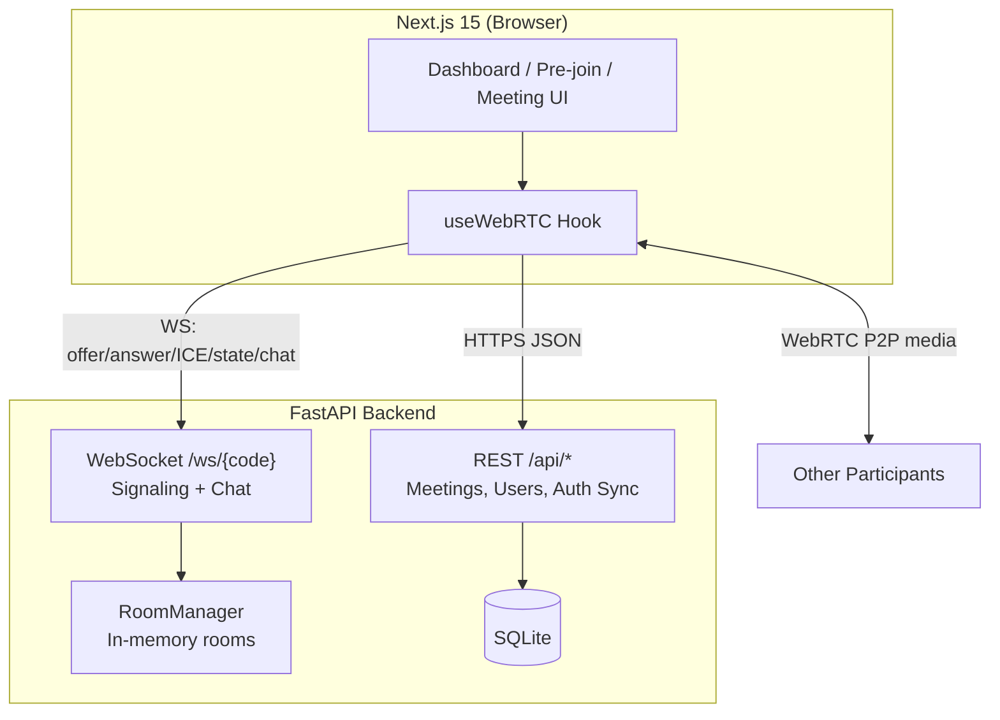

# ZOOMC — Real-Time Video Meeting Platform

A full-stack **Zoom-style** video conferencing application built from scratch. Users authenticate with Google, manage meetings from a dashboard, and join live rooms with **peer-to-peer WebRTC** video, screen sharing, in-meeting chat, and host controls — all coordinated through a custom **WebSocket signaling** layer on FastAPI.

> Built to demonstrate end-to-end product thinking: UX that mirrors a familiar product surface, a clear separation between REST (persistence) and WebSockets (real-time), and production-minded details like TURN support, host authorization, and deploy-ready configuration.

---

## Table of Contents

- [Why This Project](#why-this-project)
- [Feature Highlights](#feature-highlights)
- [Architecture](#architecture)
- [Tech Stack](#tech-stack)
- [Project Structure](#project-structure)
- [Quick Start](#quick-start)
- [Environment Variables](#environment-variables)
- [API Overview](#api-overview)
- [WebSocket Signaling](#websocket-signaling)
- [Design Decisions](#design-decisions)
- [Testing Signaling](#testing-signaling)
- [Deployment Notes](#deployment-notes)
- [Future Improvements](#future-improvements)

---

## Why This Project

Most “clone” projects stop at UI mockups. This one goes further:

| Layer                         | What it proves                                                                                     |
|-------------------------------|----------------------------------------------------------------------------------------------------|
| **Frontend**                  | Next.js 15 App Router, protected routes, responsive meeting UI, custom `useWebRTC` hook            |
| **Backend**                   | Async FastAPI, SQLAlchemy 2.0, REST for meetings + in-memory room state for live sessions          |
| **Real-time**                 | Mesh WebRTC with SDP/ICE relay, presence, chat history, and host-only moderation                   |
| **Product**                   | Instant & scheduled meetings, personal room, pre-join flow, dashboard parity with Zoom patterns    |

Interviewers can trace a single user journey — **sign in → start meeting → share screen → chat → host removes a participant** — across both codebases with minimal magic.

---

## Feature Highlights

### Dashboard & meetings
- Google OAuth via **NextAuth**
- Instant meeting creation with auto-generated codes (`123-456-7890`)
- Schedule meetings with title, time, and duration
- Join by code, upcoming/recent meeting lists, personal room editing
- API health banner and graceful error/retry states
- Responsive website

### Live meeting room
- **Pre-join** screen (camera preview, display name, device permissions)
- Multi-participant **video grid** with active-speaker highlighting
- Pin participant to spotlight layout
- Mute / camera toggle with peer state sync
- **Screen sharing** (`getDisplayMedia` with sensible constraints)
- **In-meeting chat** with history (up to 200 messages per room), validation, and unread badges
- **Host controls**: mute all, remove participant (kick + WebRTC teardown)
- Meeting footer controls styled for clarity

### Platform details
- STUN by default (`stun.l.google.com`); optional **TURN** via env for NAT traversal
- WebSocket URL resolution works on `localhost`, `127.0.0.1`, and LAN IPs in development
- Seeded SQLite database for first-run demo data
- Windows-friendly `start-frontend.ps1` / `start-backend.ps1` scripts

---

## Architecture



**Signaling vs media:** The server never touches video/audio bytes. It only routes JSON (SDP, ICE candidates, presence, chat). Media flows **mesh-style** between browsers — appropriate for small groups and a strong learning/demo footprint.

---

## Tech Stack

| Area                   | Technologies                                                                                 |
|------------------------|----------------------------------------------------------------------------------------------|
| **Frontend**           | Next.js 15, React 19, TypeScript, Tailwind CSS, NextAuth, Zustand, Framer Motion, Lucide     |
| **Backend**            | FastAPI, Uvicorn, SQLAlchemy 2.0 (async), Pydantic, aiosqlite / asyncpg                      |
| **Real-time**          | WebSockets, WebRTC (`RTCPeerConnection`), STUN/TURN                                          |
| **Auth**               | Google OAuth 2.0 (NextAuth) + `X-User-Email` header sync to backend                          |
| **Database**           | SQLite (local dev), PostgreSQL-ready (`DATABASE_URL`)                                        |

---

## Project Structure

```
assignment/
├── frontend/                 # Next.js app
│   ├── app/                  # Routes (dashboard, login, meeting/[code])
│   ├── components/           # UI (MeetingControls, VideoGrid, chat, etc.)
│   ├── hooks/                # useWebRTC, useMediaDevices, useMediaQuery
│   └── lib/                  # API client, env resolution, types
├── backend/
│   ├── app/
│   │   ├── routers/          # REST: meetings, users, dashboard
│   │   ├── ws/               # Signaling, RoomManager, chat validation
│   │   ├── models.py         # User, Meeting, Participant
│   │   └── main.py           # FastAPI entry + CORS + lifespan seed
│   └── scripts/              # WebSocket signaling smoke test
├── start-frontend.ps1
├── start-backend.ps1
└── README.md
```

---

## Quick Start

### Prerequisites

- **Node.js** 18+ and npm
- **Python** 3.11+
- Google Cloud OAuth credentials (for sign-in)

### 1. Clone and configure

```bash
git clone <https://github.com/Bhavna0905/assignment.git>
cd assignment
```

Copy environment files:

```bash
cp backend/.env.example backend/.env
# Create frontend/.env.local (see Environment Variables below)
```

### 2. Start the backend

**Windows (recommended):**
```powershell
.\start-backend.ps1
```

**Manual:**

```bash
cd backend
python -m venv .venv
# Windows: .venv\Scripts\activate
# macOS/Linux: source .venv/bin/activate
pip install -r requirements.txt
uvicorn app.main:app --reload --host 127.0.0.1 --port 8000
```

API: [http://127.0.0.1:8000](http://127.0.0.1:8000)  
Health: `GET /api/health` → `{ "status": "ok" }`

### 3. Start the frontend

**Windows:**

```powershell
.\start-frontend.ps1
```

**Manual:**

```bash
cd frontend
npm install
npm run dev
```

App: [http://localhost:3000](http://localhost:3000)

### 4. Sign in and try a meeting

1. Open the app and sign in with Google.
2. Click **New Meeting** (or use a seeded upcoming meeting code from the dashboard).
3. Complete pre-join, then test mute, screen share, chat, and participants panel.

> **Tip:** Open the same meeting URL in two browser profiles to verify multi-peer video and chat.

---

## Environment Variables

### Backend (`backend/.env`)

| Variable | Description |
|----------|-------------|
| `FRONTEND_URL` | Frontend origin (CORS / redirects) |
| `ALLOWED_ORIGINS` | Comma-separated CORS origins |
| `DATABASE_URL` | e.g. `sqlite+aiosqlite:///./zoom_clone.db` or Postgres URL |

### Frontend (`frontend/.env.local`)

| Variable | Required | Description |
|----------|----------|-------------|
| `NEXTAUTH_URL` | Yes | e.g. `http://localhost:3000` |
| `NEXTAUTH_SECRET` | Yes | Random secret (`openssl rand -base64 32`) |
| `GOOGLE_CLIENT_ID` | Yes | Google OAuth client ID |
| `GOOGLE_CLIENT_SECRET` | Yes | Google OAuth client secret |
| `NEXT_PUBLIC_API_URL` | No | Defaults to host:8000 in browser |
| `NEXT_PUBLIC_WS_URL` | No | Defaults to `ws://<host>:8000` |
| `NEXT_PUBLIC_TURN_URL` | No | TURN server for restrictive networks |
| `NEXT_PUBLIC_TURN_USERNAME` | No | TURN username |
| `NEXT_PUBLIC_TURN_CREDENTIAL` | No | TURN credential |

---

## API Overview

| Method | Endpoint | Purpose |
|--------|----------|---------|
| `GET` | `/api/health` | Liveness check |
| `GET` | `/api/me` | Current user profile |
| `POST` | `/api/auth/sync` | Upsert user after OAuth |
| `GET` | `/api/meetings` | Dashboard (upcoming + recent) |
| `POST` | `/api/meetings/instant` | Create instant meeting |
| `POST` | `/api/meetings/schedule` | Schedule a meeting |
| `GET` | `/api/meetings/{code}` | Meeting metadata |
| `POST` | `/api/meetings/{code}/participants` | Register join attempt |

Authenticated requests send `X-User-Email` from the session (see `frontend/lib/api.ts`).

---

## WebSocket Signaling

**Endpoint:** `ws://<host>:8000/ws/{meeting_code}?name=...&is_host=true|false`

| Message type | Direction | Purpose |
|--------------|-----------|---------|
| `self` | Server → client | Assign `peerId`, host flags |
| `existing-peers` | Server → client | Room snapshot on join |
| `peer-joined` / `peer-left` | Broadcast | Presence |
| `offer` / `answer` / `ice-candidate` | Client ↔ relay | WebRTC negotiation |
| `state` / `peer-state` | Client ↔ broadcast | Mute, camera, screen share |
| `host-mute-all` / `force-mute` | Host → all | Moderation |
| `host-remove-peer` | Host → target | Kick participant |
| `join-meeting-chat` / `send-message` / `receive-message` | Chat | Validated, capped history |

Implementation: `backend/app/ws/signaling.py`, `backend/app/ws/room_manager.py`, `frontend/hooks/useWebRTC.ts`.

---

## Design Decisions

1. **Mesh WebRTC (no media server)**  
   Keeps infrastructure simple and latency low for demos. Trade-off: CPU/bandwidth scale with participant count — documented as a future SFU migration path.

2. **In-memory `RoomManager` for live state**  
   Meetings persist in SQL; active peers and chat history live in memory per room. Fast to implement, easy to reason about; Redis would be the next step for horizontal scale.

3. **Single WebSocket per peer**  
   Signaling and chat share one connection — fewer moving parts than separate chat and signaling sockets.

4. **Host peer tracked server-side**  
   `is_host` query param registers the host; server validates `host-mute-all` and `host-remove-peer` so clients cannot spoof moderation.

5. **Pre-join gate**  
   Media permissions and display name are collected before `useWebRTC` connects — avoids half-open peer connections and improves UX.

6. **Next.js middleware auth**  
   Dashboard routes require login; meeting flow integrates session display names while keeping the real-time path explicit.

---

## Testing Signaling

With the API running:

```bash
cd backend
# activate venv, then:
python scripts/test_signaling.py
```

This script opens two WebSocket clients, verifies peer discovery, and exercises the signaling contract without a browser.

---

## Deployment Notes

| Component | Suggested platform |
|-----------|--------------------|
| Frontend  | Vercel             |
| Backend   | Render             |
| Database  | Render             |

Set `ALLOWED_ORIGINS` and `FRONTEND_URL` to your production frontend URL. Configure the same Google OAuth redirect URIs for production domains.

Optional: add `NEXT_PUBLIC_TURN_*` when users behind symmetric NAT cannot connect peer-to-peer with STUN alone.

---

## Screenshots


---

## Author
**Bhavna Meemroth** — [GitHub](https://github.com/Bhavna0905) · [LinkedIn](https://www.linkedin.com/in/bhavna-meemroth-351880311/) 
---
